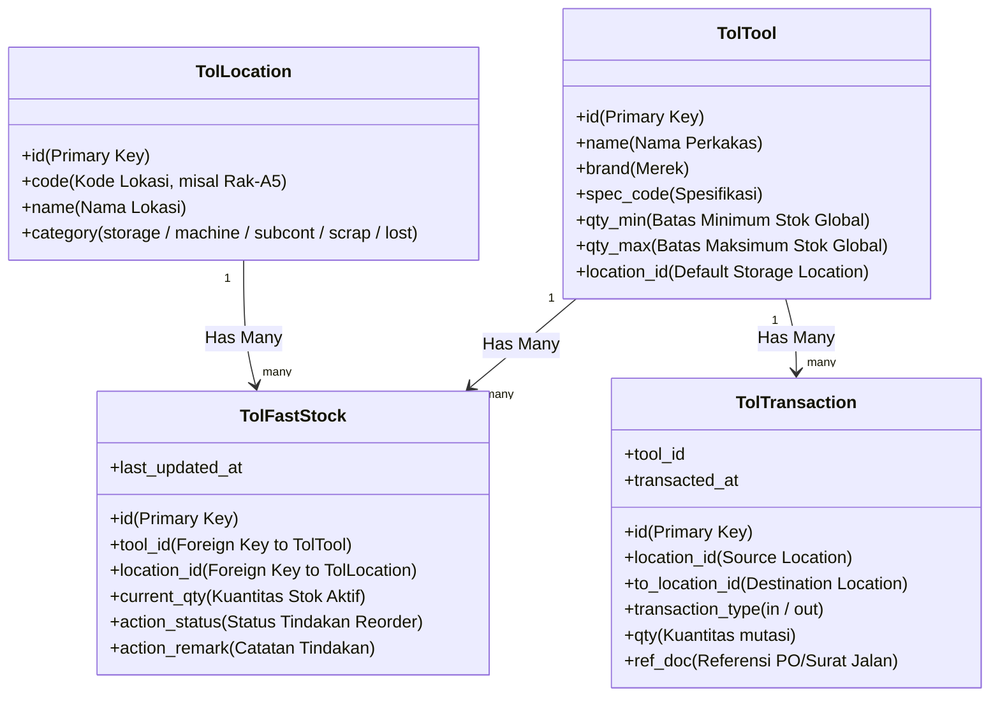

# PRD & Technical Architecture: Optimization of Multi-Location Tool Inventory

Document ini merangkum analisis arsitektur data saat ini, aliran data (*data flow*), batasan rancangan, serta rekomendasi optimasi (*Product Requirement Document* / PRD) untuk sistem pelacakan stok multi-lokasi pada modul **Promise Inventory (Fast Moving Tool)**.

---

## 1. Analisis Arsitektur Data Saat Ini

Sistem pelacakan stok saat ini dibangun menggunakan model relasional Laravel Eloquent yang melacak stok hingga ke level spesifik lokasi penyimpanan (Racks/Storage) maupun lokasi penggunaan (Machine/Subcontractor).

### A. Entitas & Hubungan Database (ERD)



### B. Aliran Data (*Data Flow*) Transaksi

#### 1. Inisialisasi Stok / Penerimaan Baru (Stock IN)
*   **Aktor**: Gudang (Operator)
*   **Aliran Data**:
    1.  Operator menginput jumlah stok masuk pada `ToolFastStockController@store`.
    2.  Sistem mencari atau membuat record `TolFastStock` untuk pasangan `(tool_id, default_location_id)`.
    3.  Stok ditambahkan ke `TolFastStock.current_qty`.
    4.  Sistem mencatat entri sejarah di `TolTransaction` dengan tipe `in` (nilai positif).

#### 2. Pengeluaran / Pemindahan Stok (Stock OUT)
*   **Aktor**: Operator Produksi / Subcon
*   **Aliran Data**:
    1.  Operator menginput `source_location` (Rak) dan `destination_location` (Mesin/Subcont) di `ToolFastStockController@out`.
    2.  Sistem memotong `current_qty` di `TolFastStock` lokasi asal.
    3.  Sistem memeriksa jenis lokasi tujuan:
        *   Jika bertipe aktif (`storage`, `machine`, `subcont`), sistem menambah/membuat `TolFastStock` di lokasi tujuan tersebut.
        *   Jika bertipe konsumsi/hilang (`scrap`, `lost`), stok dilepas (tidak dialokasikan lagi).
    4.  Sistem mencatat mutasi di `TolTransaction` dengan tipe `out` (nilai negatif).

---

## 2. Review Arsitektur: Kelebihan & Kelemahan

### ✓ Kelebihan (Kesesuaian Standar)
1.  **Multi-Location Tracking**: Sangat tepat untuk industri manufaktur presisi. Sistem dapat mengetahui dengan pasti berapa unit perkakas yang siap di gudang (Rak) dan berapa unit yang sedang berada di area produksi (Mesin) atau vendor luar (Subkontraktor).
2.  **Double-Entry Ledger Audit**: Tabel `tol_t_transactions` bertindak sebagai buku jurnal keuangan. Semua mutasi memiliki riwayat masuk/keluar yang *auditable* (tidak bisa dihapus, hanya bisa ditambahkan).

### ✗ Kelemahan (Menyulitkan Pengembangan & Performa)
1.  **Action Plan (`action_status` & `action_remark`) Salah Tempat**:
    *   **Masalah**: Kolom status order ("Need Action", "Ordered") dan catatan tindak lanjut ditempatkan di tabel stok `tol_t_fast_stock` (level lokasi).
    *   **Dampak**: Rencana pemesanan barang adalah keputusan tingkat **Perkakas (Tool)** secara global, bukan rak atau mesin. Karena ditaruh di level lokasi, backend harus melakukan trik rumit untuk mencari record stok di default lokasi hanya untuk mengambil/menyimpan catatan tersebut. Jika stok di lokasi tersebut nol, catatan berisiko tidak terbaca atau terhapus.
2.  **Overhead aggregate `SUM` Dinamis**:
    *   **Masalah**: Untuk menghitung total stok perkakas di dashboard dan mengkalkulasi status warning (`Critical`/`Warning`/`Safe`), sistem harus selalu menjumlahkan `current_qty` dari seluruh lokasi secara dinamis.
    *   **Dampak**: Semakin banyak lokasi aktif dan ragam perkakas, query dashboard akan melambat secara signifikan (*N+1 query issue* atau *aggregate computation overhead*).

---

## 3. Product Requirement Document (PRD): Target Optimasi Arsitektur

Dokumen persyaratan produk ini mengarahkan refaktorisasi arsitektur agar aplikasi menjadi **lebih cepat (high performance)**, **kode lebih sederhana**, dan **skalabel**.

### Persyaratan 1: Migrasi Action Plan ke Entitas Master (`tol_m_tools`)
*   **Persyaratan**: Pindahkan kolom `action_status` dan `action_remark` dari tabel `tol_t_fast_stock` ke tabel master `tol_m_tools`.
*   **Dampak Teknis**:
    *   Proses update status pemesanan dari Dashboard menjadi sangat mudah: `TolTool::find($id)->update(['action_status' => $status])`.
    *   Catatan tindak lanjut tetap utuh dan aman meskipun stok fisik perkakas di semua lokasi sedang kosong.

### Persyaratan 2: Implementasi Caching Stok (`total_qty`) di Tabel Master
*   **Persyaratan**: Tambahkan kolom `total_qty` pada tabel master `tol_m_tools`.
*   **Dampak Teknis**:
    *   Dashboard tidak perlu lagi menghitung jumlah stok secara dinamis. Query penentuan status stock warning menjadi instan: `SELECT * FROM tol_m_tools WHERE total_qty <= qty_min`.
    *   Kecepatan loading dashboard naik hingga **> 500%** karena menghilangkan operasi relasional `SUM` pada data transaksi besar.

### Mekanisme Sinkronisasi Stok (Event-Driven Caching)
Untuk menjaga agar `total_qty` di tabel master selalu sinkron dengan rincian di tabel lokasi `TolFastStock`, kita menerapkan **Eloquent Observers** atau **Model Hooks** di Laravel.

Setiap kali ada perubahan kuantitas stok di lokasi, trigger otomatis akan memperbarui kolom total stok di master tool.

#### Contoh Implementasi Observers (`TolFastStockObserver.php`):
```php
namespace App\Observers;

use App\Models\InventoryModel\Tool\TolFastStock;

class TolFastStockObserver
{
    // Terpanggil otomatis saat stok di suatu lokasi di-update atau ditambah
    public function saved(TolFastStock $stock)
    {
        $this->syncTotalQty($stock->tool_id);
    }

    // Terpanggil otomatis jika data stok di suatu lokasi dihapus
    public function deleted(TolFastStock $stock)
    {
        $this->syncTotalQty($stock->tool_id);
    }

    private function syncTotalQty($toolId)
    {
        if (!$toolId) return;
        
        $total = TolFastStock::where('tool_id', $toolId)->sum('current_qty');
        
        \DB::table('tol_m_tools')
            ->where('id', $toolId)
            ->update(['total_qty' => $total]);
    }
}
```

---

## 4. Rencana Langkah Migrasi & Refaktorisasi

Jika Anda menyetujui arah rancangan ini, langkah migrasi dapat dilakukan secara bertahap tanpa mengganggu operasional sistem berjalan:

1.  **Langkah 1: Migrasi Database (Migration Script)**
    *   Buat migrasi untuk menambahkan `action_status`, `action_remark`, dan `total_qty` ke tabel `tol_m_tools`.
    *   Buat script migrasi data otomatis (*data seeding*) untuk memindahkan catatan `action_status`/`remark` lama dari `tol_t_fast_stock` ke tabel master `tol_m_tools`.
    *   Hitung total stok awal untuk mengisi kolom `total_qty` di master.
    
2.  **Langkah 2: Registrasi Observer**
    *   Registrasikan `TolFastStockObserver` di `AppServiceProvider` agar sinkronisasi berjalan otomatis setiap kali ada transaksi stok.

3.  **Langkah 3: Penyederhanaan Kode Controller**
    *   Hapus logika pencarian `$primaryStock` di `ToolDashboardController.php`.
    *   Ubah pemanggilan `SUM` relasional menjadi pembacaan properti langsung: `$tool->total_qty`.
    *   Hapus kolom lama (`action_status` & `action_remark`) di tabel `tol_t_fast_stock` jika transisi telah dinyatakan 100% stabil.
